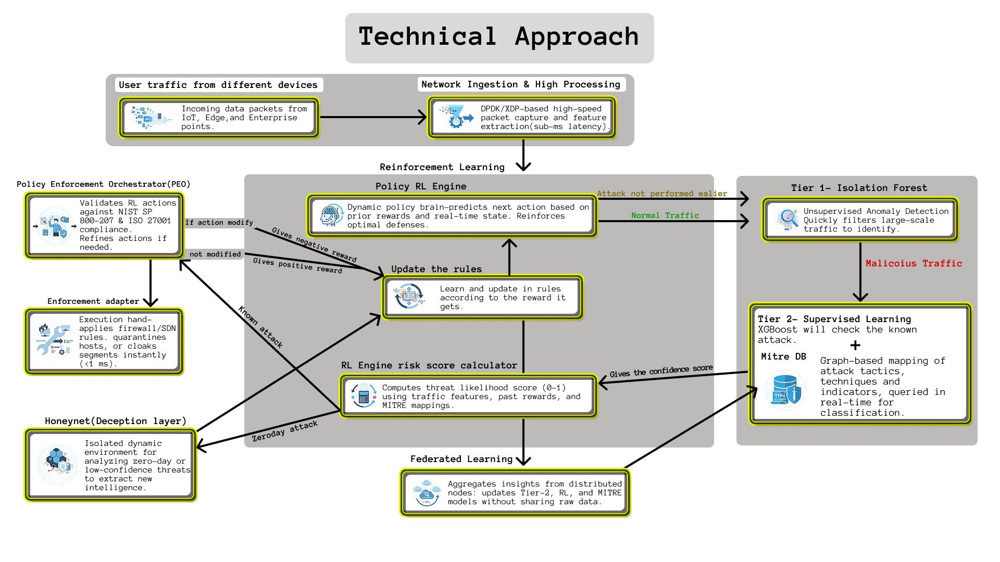

# Fortress AI

### AI-Driven Next-Generation Firewall for Dynamic Threat Detection & Zero Trust

Fortress AI is an adaptive cyber-defense platform designed to detect, classify, mitigate, and learn from evolving network attacks.

Instead of relying only on static firewall rules, the system combines multi-layer Machine Learning, Reinforcement Learning, MITRE ATT&CK intelligence, Honeypot-based analysis, Federated Learning, and Zero Trust principles into a single security pipeline.

---

## The Problem

Modern networks face several limitations with traditional firewall and signature-based security systems:

- **Static security policies** are slow to adapt to new attack patterns.
- **Unknown and zero-day attacks** may not match existing signatures.
- Sending every traffic flow through deep ML analysis introduces unnecessary computational overhead.
- **Threat intelligence is often isolated** from the actual detection and response pipeline.
- Centralizing network traffic for model training creates **data privacy** concerns.
- Traditional perimeter security does not provide sufficient **microsegmentation and least-privilege enforcement**.

Fortress AI addresses these problems by combining fast-path detection, progressive ML analysis, adaptive policy learning, behavioral investigation, and distributed threat intelligence.

---

## Architecture & Technical Workflow



The system follows a progressive detection and response architecture:

```text
        Network Traffic
                │
                ▼
Fast Ingestion & Feature Extraction
                │
                ▼
      Tier-0 ──► Learned Rules
                │       │
                │       └── Known pattern → Immediate Enforcement
                │
                ▼
      Tier-1 ──► Isolation Forest
                │
                │       Unsupervised anomaly detection
                ▼
      Tier-2 ──► XGBoost
                │
                │       Supervised attack classification
                ▼
      MITRE ATT&CK
                │
                │       Tactic / Technique context
                ▼
Reinforcement Learning
                │
        ├───────────────┐
        ▼               ▼
Known Attack       Unknown / Low Confidence
        │               │
        ▼               ▼
Block /            Honeypot /
Quarantine         Behavioral Analysis
        │               │
        └───────┬───────┘
                ▼
      Policy / Rule Update
                │
                ▼
        Persistent State
                │
                ▼
Future Attacks Become
   Faster to Handle
```

### How the Technical Approach Solves the Problems

| Problem | Technical Approach | What it achieves |
| --- | --- | --- |
| Static rules become outdated | Reinforcement Learning + adaptive policy repository | Learns from previous attack outcomes and updates defense policies |
| Unknown attacks are difficult to detect | Tier-1 Isolation Forest | Detects anomalous traffic without requiring every attack to be previously labeled |
| Suspicious traffic needs deeper classification | Tier-2 XGBoost | Classifies known attack patterns and provides confidence for downstream decisions |
| ML predictions lack security context | MITRE ATT&CK mapping | Converts detected behavior into structured tactics and techniques |
| Deep analysis can increase latency | Tiered detection architecture | Known traffic and learned attacks can be handled before expensive analysis |
| Zero-day behavior is difficult to understand | Honeypot / deception layer | Isolates suspicious low-confidence traffic for behavioral investigation |
| Repeated attacks repeatedly consume detection resources | Learned Tier-0 rules | Previously learned malicious patterns can be blocked early |
| Organizations cannot freely share raw network data | Federated Learning | Enables collaborative model improvement without requiring raw traffic to be centralized |
| Internal network assets remain exposed | Zero Trust + microsegmentation + asset cloaking | Reduces lateral movement opportunities and limits unnecessary asset exposure |
| Security decisions need to be observable | FastAPI + REST + WebSockets | Streams attack lifecycle events to the SOC dashboard |
| Security state should survive restarts | PostgreSQL / Supabase persistence | Stores attacks, events, rules, policies and learning state durably |

---

## Adaptive Defense: The Core Idea

The most important behavior of Fortress AI is that the system learns from previous attacks.

### First occurrence

A previously unseen attack follows the deeper detection pipeline:

```text
Attack
  ↓
Tier-0 Rule Miss
  ↓
Isolation Forest
  ↓
XGBoost Classification
  ↓
MITRE ATT&CK Context
  ↓
RL Decision
  ↓
Block / Quarantine / Honeypot
  ↓
Policy & Rule Update
```

### Subsequent occurrence

When an equivalent malicious pattern is encountered again:

```text
Same Attack
     ↓
Tier-0 Learned Rule Match
     ↓
Early Mitigation
```

This creates a continuous defense loop:

```text
DETECT
  ↓
CLASSIFY
  ↓
CONTEXTUALIZE
  ↓
DECIDE
  ↓
MITIGATE
  ↓
LEARN
  ↓
PERSIST
  ↓
DEFEND FASTER NEXT TIME
```

The firewall therefore evolves from a system that only detects attacks into one that can learn from previous defense outcomes.

---

## System Design

Fortress AI separates the major responsibilities of the platform:

```text
       ┌─────────────────────┐
       │   TanStack Frontend │
       │   Red Team / SOC    │
       └──────────┬──────────┘
                  │
            REST / WebSocket
                  │
                  ▼
       ┌─────────────────────┐
       │       FastAPI       │
       │   API + Orchestrator│
       └──────────┬──────────┘
                  │
   ┌──────────────┼──────────────┐
   ▼              ▼              ▼
ML Detection  RL Policy       MITRE Intel
   │              │              │
   └──────────────┼──────────────┘
                  ▼
        Policy / Enforcement
                  │
                  ▼
       ┌─────────────────────┐
       │      Supabase       │
       │     PostgreSQL      │
       └─────────────────────┘
```

### Key design principles

**Progressive computation**

Traffic is not treated equally. The system progressively increases analysis depth only when required.

**Separation of detection and enforcement**

ML/RL determines the security decision while the policy enforcement layer translates that decision into actions such as blocking, quarantine, or redirection.

**Backend as the source of truth**

Attack state, classifications, policies, events, and persistent security state are owned by the backend.

**Event-driven observability**

WebSockets expose the attack lifecycle to the SOC so analysts can observe how a decision progresses through the detection pipeline.

**Persistent adaptive state**

Learned rules, policies, attacks, and security events are persisted instead of existing only in application memory.

---

## Red Team → AI-NGFW → Blue Team

Fortress AI separates attack generation from security operations.

```text
        RED TEAM
             │
             │ Attack / PCAP
             ▼
        FastAPI
             │
             ▼
   AI-NGFW Pipeline
             │
  ┌──────────┴──────────┐
  ▼                     ▼
Supabase              Live Events
  │                     │
  └──────────┬──────────┘
             ▼
        BLUE TEAM
             │
             ▼
      SOC Dashboard
```

This allows a Red Team attack to be processed by the backend while a separate Blue Team context observes the same attack, detection stages, classification, mitigation and resulting security state.

---

## Federated Learning & Collaborative Defense

Fortress AI extends the adaptive-defense concept beyond a single node.

Instead of requiring every organization or edge node to send raw network traffic to a central training system:

```text
Edge Node 1        Edge Node 2        Edge Node 3
      │                  │                  │
Local Training     Local Training     Local Training
      │                  │                  │
      └──────────────┬───┴──────────────────┘
                     ▼
            Model Aggregation
                     │
                     ▼
               Global Model
                     │
       ┌──────────────┼──────────────┐
       ▼              ▼              ▼
    Node 1         Node 2         Node 3
```

The intended approach is to exchange model updates rather than raw network data, enabling collaborative threat intelligence while reducing direct data-sharing requirements.

---

## Zero Trust Strategy

Fortress AI incorporates Zero Trust principles into the security model:

- Continuous verification
- Least-privilege access
- Dynamic policy enforcement
- Network microsegmentation
- Asset cloaking

The goal is to avoid treating internal traffic as automatically trusted and to limit the blast radius of compromised systems.

---

## Technology Stack

**Frontend**

- React
- TypeScript
- TanStack Router
- Vite
- Tailwind CSS
- REST API
- WebSockets

**Backend**

- Python
- FastAPI
- Uvicorn
- SQLAlchemy
- asyncpg
- Pydantic
- JWT Authentication
- WebSockets

**Machine Learning**

- Scikit-learn
- Isolation Forest
- XGBoost
- Feature preprocessing
- Anomaly detection
- Supervised threat classification

**Reinforcement Learning**

- Adaptive policy engine
- Policy state
- Reward-based policy updates
- Learned security rules
- Policy versioning

**Federated Learning**

- Distributed local training architecture
- Model update aggregation
- Federated Averaging (FedAvg) approach
- Privacy-preserving collaborative learning

**Cybersecurity**

- MITRE ATT&CK
- Zero Trust Architecture
- Microsegmentation
- Asset Cloaking
- Honeypot / Deception
- Dynamic Policy Enforcement

**Data & Infrastructure**

- PostgreSQL
- Supabase
- Render
- Docker
- REST APIs
- WebSockets

---

## Deployment Architecture

The deployed system uses a managed cloud architecture:

```text
        ┌──────────────────┐
        │ TanStack Frontend│
        └────────┬─────────┘
                 │
            HTTPS / WS
                 │
                 ▼
        ┌──────────────────┐
        │ Render           │
        │ FastAPI Service  │
        │                  │
        │ ML + RL + MITRE  │
        └────────┬─────────┘
                 │
             PostgreSQL
                 │
                 ▼
        ┌──────────────────┐
        │ Supabase         │
        │ PostgreSQL       │
        └──────────────────┘
```

The frontend communicates with the backend through the API layer and does not directly access the database.

---

## Live Demonstration

Fortress AI supports both demonstration and live backend operation.

### Demo Mode

Provides a controlled environment for demonstrating the SOC interface and attack lifecycle.

### Live Mode

Uses the deployed FastAPI backend:

```text
Red Team
   ↓
FastAPI
   ↓
Real Detection Pipeline
   ↓
RL Decision
   ↓
Supabase Persistence
   ↓
Blue Team SOC
```

- **Live app (frontend):** https://fortress-ai-ngfw.vercel.app/dashboard
- **Live API (backend):** https://fortress-ai-ngfw.onrender.com/api
- **API docs (Swagger):** https://fortress-ai-ngfw.onrender.com/docs

The live system demonstrates:

- Real backend-generated attack IDs
- Multi-stage attack processing
- Live pipeline events
- MITRE ATT&CK mapping
- Adaptive RL decisions
- Learned-rule behavior
- Persistent attack history
- Red Team → Blue Team visibility

---

## Smart India Hackathon 2025

- **Problem Statement ID:** 25160
- **Problem Statement:** AI-Driven Next-Generation Firewall for Dynamic Threat Detection and Zero Trust Implementation
- **Theme:** Blockchain & Cybersecurity
- **Team:** Cache me if you cann

Fortress AI was developed as a solution to the challenge of building a dynamic, adaptive and Zero Trust-oriented next-generation firewall.

---

## Project in One Line

Fortress AI is a self-improving cyber-defense pipeline that detects threats through layered ML, contextualizes them with MITRE ATT&CK, makes adaptive decisions using RL, investigates unknown behavior through deception, and learns from previous attacks to defend faster.

---

## Team

**Cache me if you cann**

Built for Smart India Hackathon 2025.